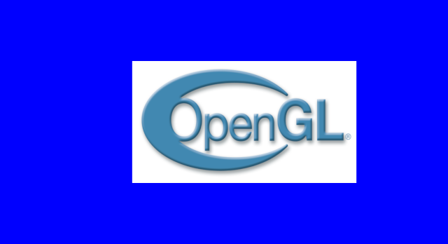

# Uploading a texture

A texture is an image or a collection of images loaded into video memory.

In order to load a texture, we must first decode the image format that stores our image (for example, PNG). To do so, we are going to use the `image` library. Let's add it to the Cargo.toml file:

```toml
[dependencies]
image = "0.24"
```

In order to load the image, we just need to call `image::load`:

```rust
let image = image::load(std::io::Cursor::new(&include_bytes!("/path/to/image.png")),
                        image::ImageFormat::Png).unwrap().to_rgba8();
let image_dimensions = image.dimensions();
let image = glium::texture::RawImage2d::from_raw_rgba_reversed(&image.into_raw(), image_dimensions);
```

And in order to upload the image as a texture, it's as simple as:

```rust
let texture = glium::texture::Texture2d::new(&display, image).unwrap();
```

# Using the texture

There is no automatic way to display a texture over a shape with OpenGL. Just like any other rendering techniques, it must be done manually. This means that we must manually load color values from our texture and set them within our fragment shader.

To do so, we first have to modify our struct and shape in order to indicate to which location of the texture each vertex is attached to, we'll also be changing it to a square shape so that the image isn't distorted:

```rust
#[derive(Copy, Clone)]
struct Vertex {
    position: [f32; 2],
    tex_coords: [f32; 2],       // <- this is new
}

implement_vertex!(Vertex, position, tex_coords);        // don't forget to add `tex_coords` here

let shape = vec![
    Vertex { position: [-0.5, -0.5], tex_coords: [0.0, 0.0] },
    Vertex { position: [ 0.5, -0.5], tex_coords: [1.0, 0.0] },
    Vertex { position: [ 0.5,  0.5], tex_coords: [1.0, 1.0] },

    Vertex { position: [ 0.5,  0.5], tex_coords: [1.0, 1.0] },
    Vertex { position: [-0.5,  0.5], tex_coords: [0.0, 1.0] },
    Vertex { position: [-0.5, -0.5], tex_coords: [0.0, 0.0] },
];
```

Texture coordinates range from `0.0` to `1.0`. The coordinates `(0.0, 0.0)` correspond to the bottom-left hand corner of the texture, and `(1.0, 1.0)` to the top-right hand corner.

This new `tex_coords` attribute will be passed to the vertex shader, just like `position`. We don't need to do anything to it, and we are just going to pass it through to the fragment shader:

```glsl
#version 140

in vec2 position;
in vec2 tex_coords;
out vec2 v_tex_coords;

uniform mat4 matrix;

void main() {
    v_tex_coords = tex_coords;
    gl_Position = matrix * vec4(position, 0.0, 1.0);
}
```

Similarly to the `vertex_color` variable, the value of `v_tex_coords` will be interpolated so that each pixel gets a value that corresponds to its position. This value corresponds here to the coordinates in the texture that this pixel is attached to.

All that's left to do in our fragment shader is to get the value of the color at these coordinates in the texture with the `texture()` function that is available in GLSL.

```glsl
#version 140

in vec2 v_tex_coords;
out vec4 color;

uniform sampler2D tex;

void main() {
    color = texture(tex, v_tex_coords);
}
```

As you can see, a texture is a `uniform` of type `sampler2D`. There are many types of textures and texture uniforms, and `sampler2D` corresponds to a simple two-dimensional texture.

Since the texture is a uniform, we have to pass a reference to it in our Rust code that does the drawing:

```rust
let uniforms = uniform! {
    matrix: [
        [1.0, 0.0, 0.0, 0.0],
        [0.0, 1.0, 0.0, 0.0],
        [0.0, 0.0, 1.0, 0.0],
        [ x , 0.0, 0.0, 1.0f32],
    ],
    tex: &texture,
};
```

And here is the result:



**[You can find the entire source code here](https://github.com/glium/glium/blob/master/examples/tutorial-06.rs).**
